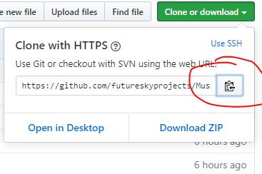
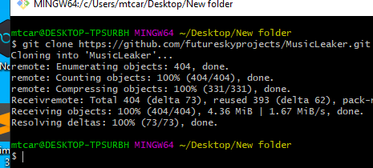
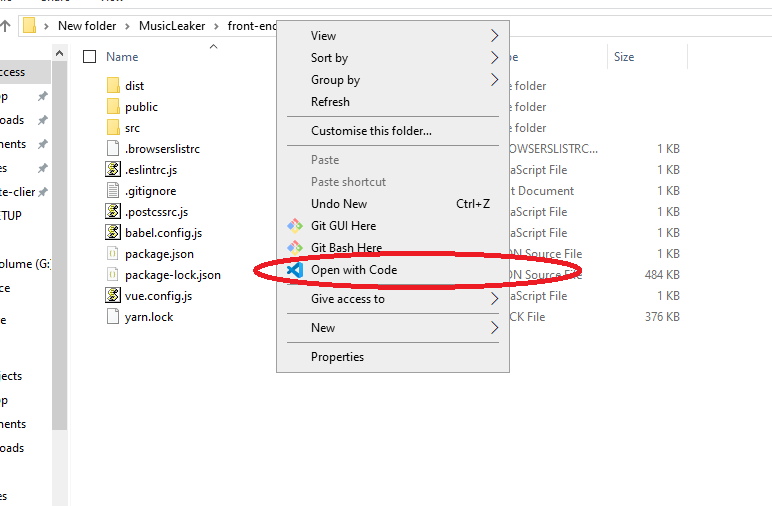
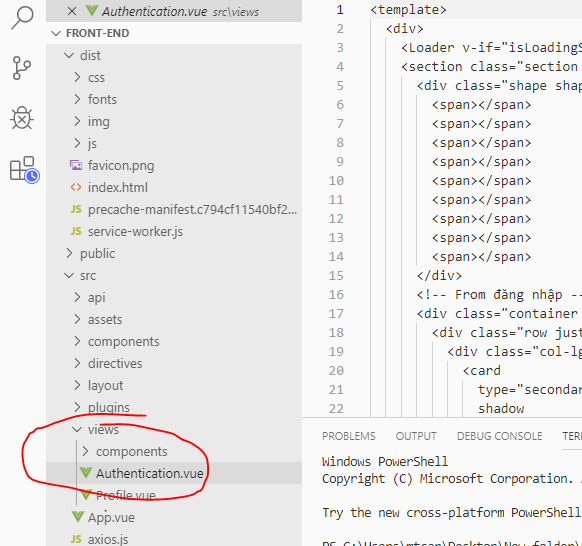
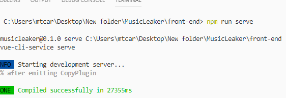
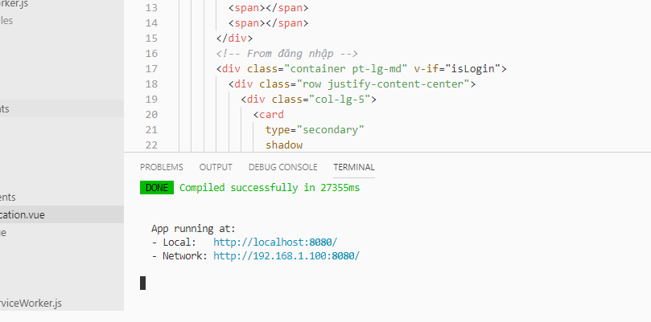
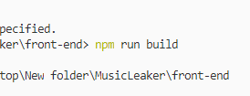
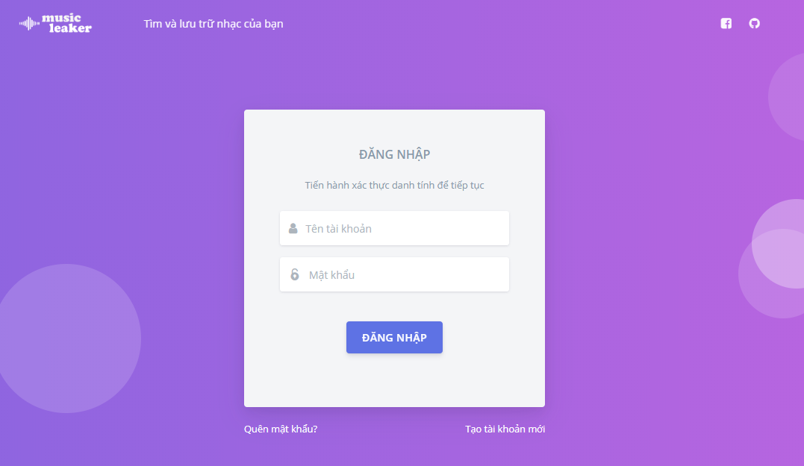
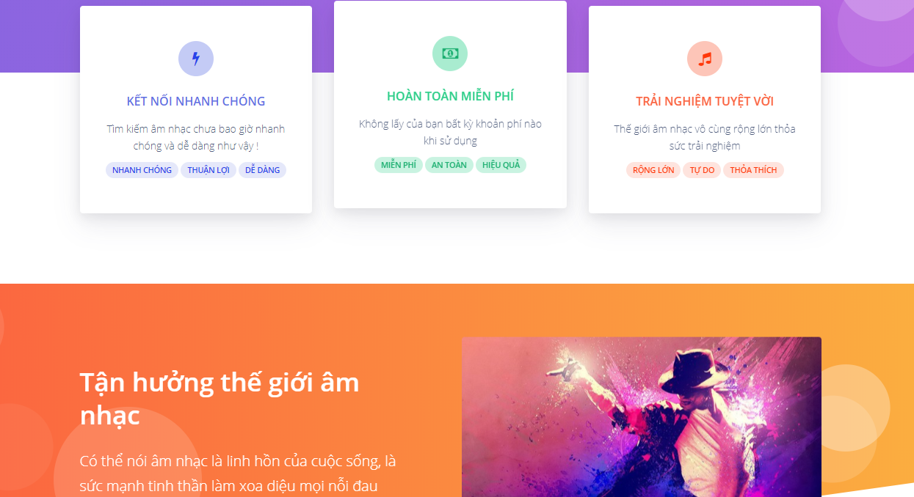
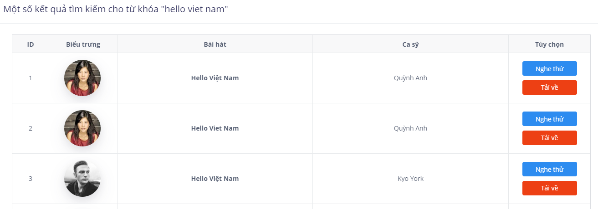

# Music Leaker - ỨNG DỤNG WEB TÌM KIẾM ÂM NHẠC MIỄN PHÍ - FREE FINDING SONG INTERNET

[](https://www.php.net/downloads.php)
[](https://www.php.net/downloads.php)
[](https://www.php.net/downloads.php)
[](https://developer.mozilla.org/vi/docs/Web/CSS)
[](https://www.php.net/downloads.php)
[](https://www.mysql.com/)

[](http://musicleaker.unaux.com/authentication)

♫♬♫♭♮♯♫♬♫♭♮♯♫♬♫♭♮♯♫♬♫♭♮♯♫♬♫♭♮♯♫♬♫♭♮♯♫♬♫♭♮♯♫♬♫♭♮♯♫♬♫♭♮♯♫♬♫♭♮♯♫♬♫♭♮♯♫♬♫♭♮♯♫♬♫♭♮♯♫♬
<h2> ✈ Công dụng, ứng dụng  </h2>
<h3> Công dụng </h3>

 - Tìm kiếm bài hát theo tên, ca sĩ
 - Tải nhạc miễn phí
 - Nghe nhạc trực tuyến
 - Gửi thông tin đến email người dùng
 
 <h3> Ứng dụng </h3>
 
 - Áp dụng cho các nhóm nhỏ, tổ chức phi lợi nhuận trong việc chia sẻ âm nhạc miễn phí.
 - Những người yêu thích sự tiện lợi , nhanh chóng trong việc nghe và tải nhạc 
 
<h2>☝ Mục đích của bài toán</h2>

<h3> Đầu vào</h3>

- Tên bài hát, tên ca sĩ, tên album
- Link Address
- Youtube link Address
- Email, tài khoản, mật khẩu người dùng 

<h3> Đầu ra </h3>

- Danh sách bài hát
- Bản nghe thử 
- Link download 
- Share tới mạng xã hội 

<h2>⚙ Các bước cài đặt</h2>

- Bước 1: Đầu tiên bạn copy link Clone Responsitory này  ☟
<p align="center">
  
</p>


- Bước 2: Clone vào một folder bất kỳ trong máy tính
<p align="center">
  
</p>


- Bước 3: Bạn truy cập website https://nodejs.org/ tải platform NodeJS về máy
<p align="center">
  
</p>


- Bước 4: Sau khi tải về tiến hành cài đặt NodeJS 

- Bước 5: Mở thư mục vừa clone, sau đó truy cập vào thư mục front-end

- Bước 6: Click chuột phải chọn open with visual code nếu bạn chưa cài thì tiến hành cài tại https://code.visualstudio.com
<p align="center">
  
</p>

- Bước 7: Vào Giao diện vs code bạn mở thứ tự dist -> src -> view - > authentication.vue
<p align="center">
  
</p>


- Bước 8: Bạn nhấn tổ hợp phím Ctrl + ( ~ )  để mở giao diện Terminal 

- Bước 9: Bạn gõ ```npm i``` để cài đặt nodeJS vào project 

<p align="center">
  
</p>


- Bước 10: Sau khi cài đặt xong bạn gõ tiếp ```npm run serve``` để chạy trang web 

<p align="center">
  
</p>

- Bước 11: Terminal sẽ xuất hiện đường dẫn localhost bạn nhấn Ctrl + Click chuột để truy cập 

<p align="center">
  
</p>


- Bước 12: Trang web sẽ hiển thị ngay sau đó

- Bước 13: Nếu bạn có thay đổi gì, hoặc muốn update project chỉ cần gõ ```npm run build``` để tiến hành build lại 

<p align="center">
  
</p>

<h2>📑 Nội dung của bài toán </h2>

- Chức năng đã làm được:
<p>- Thiết kế giao diện: Trang chủ, Đăng ký, Đăng nhập, Download</p>
<p align="center">
  
</p>

<p align="center">
  
</p>


<p>- Thao tác</p>

<ul>
    <li> Nhập tên bài hát hiển thị kết quả </li>
    <li> Nhập tên ca sĩ hiển thị kết quả </li>
    <li> Nhấn nút nghe thử tiến hành phát nhạc</li>
    <li> Nhấn nút download tải nhạc về máy</li>
</ul>
<p align="center">
  
</p>

<p align="center">
  
</p>


<h2>💻 Hướng phát triển cho bài toán</h2>

- Hiển thị phân loại nhạc, thể loại, dòng nhạc, top 10 ...
- Dán link-address, địa chỉ album nhạc để tìm ra danh sách bài hát tự động
- Dán vào link-youtube, tự động convert Youtube thành MP3 và hiển thị link download.
- Phát triển thành một Chrome Extension tích hợp hỗ trợ người dùng tải nhanh ở các địa chỉ khác nhau.   

<h2>👦 Tác giả: </h3>
     
- **Nguyễn Trọng Nghĩa** - Back End Developer (PHP, MySQL) -  [link to GitHub!](https://github.com/futureskyprojects)
- **Hoàng Thiên Phú** - Front End Developper (HTML, CSS, Javascripts, Bootstrap 4, Git Manager) - [link to GitHub!](https://github.com/mchoang98)
   
   
   
